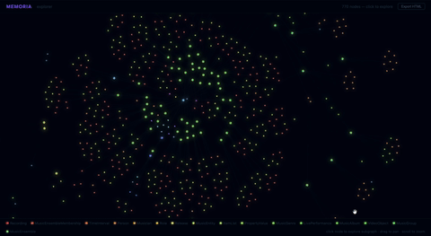

# Memoria

A domain-agnostic RDF knowledge graph explorer. Load any `.ttl` file and navigate it as an interactive force-directed graph.

> **POC** — built to explore how RDF graphs can be rendered and navigated visually. The demo uses a Live Aid knowledge graph.



---

## Quick Start

```bash
MEMORIA_TTL=liveaid_instances_master.ttl ./start.sh
```

Opens at **http://localhost:5173**

`start.sh` kills stale processes on ports 8765/5173, starts the FastAPI backend, waits for it to be ready, then starts the Vite frontend.

---

## Manual Start

```bash
# Backend (from repo root)
MEMORIA_TTL=liveaid_instances_master.ttl uvicorn backend.api:app --host 0.0.0.0 --port 8765 --reload

# Frontend (separate terminal)
cd frontend && npm install && npm run dev
```

---

## API Endpoints

| Method | Path | Description |
|--------|------|-------------|
| GET | `/suggestions?top=N` | Top-N navigable starting points |
| GET | `/scene?uri=<uri>` | Stream scene as NDJSON |
| GET | `/neighbours?uri=<uri>` | Primary neighbours of an entity |
| GET | `/types` | Distinct entity classes with counts |
| GET | `/search?q=<query>` | Label autocomplete |
| GET | `/expand?subject_uri=&predicate_uri=` | Expand a grouped edge handle |
| GET | `/entity/<uri>` | Full entity record |

---

## Stack

- **Backend** — Python, RDFLib, NetworkX, FastAPI, uvicorn
- **Frontend** — React, Vite, d3-force, Cytoscape.js

---

## Docs

- [`EXPLORER_HANDOVER.md`](EXPLORER_HANDOVER.md) — frontend/backend flow, architecture, library choices, file map
- [`PAGINATION_STRATEGIES.md`](PAGINATION_STRATEGIES.md) — implemented and planned graph pagination approaches
